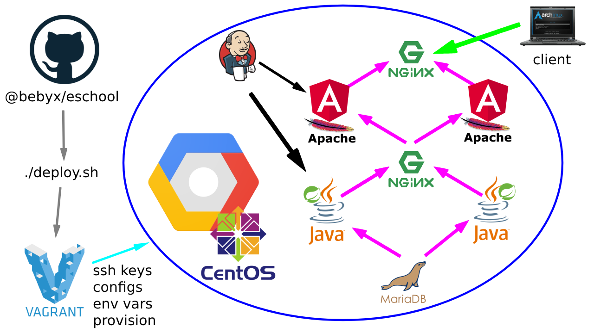

# Training deploy script for Spring/Angular app

**eSchool** is a data management app built by students of SoftServe IT Academy. It's designed to keep track of studying processes in a Ukrainian school.

My task was to deploy the app in a decentralized manner using automation tools and a CI tool **Jenkins**.

I started with deployment on local VirtualBox (with *Vagrant*). But 8 servers are too much for my home machine, I switched to **Google Cloud Platform** (still using *Vagrant*).

## Deploy app

My primary ambition was to make the deployment fully automated. I fulfilled this goal — all it takes to deploy the app is just to hit Enter with one finger (or two, if you prefer the proverb way)!

(Sure thing, beforehand you will need to adjust config to make scripts work for you.)

1. Clone the repository to your local machine.
2. Run `deploy.sh` (here's the *'hit Enter'* step).
3. Wait while scripts finish their job...
4. Open web app in your browser via `lb_fe` external IP address.

To enable Vagrantfile for yourself you will need to adjust your GCP project as per [Vagrant-Google](https://github.com/mitchellh/vagrant-google) instructions and also to reserve static external IP for `lb_be` (put it into `LB_BE_EXT_IP` variable at the top of the `Vagrantfile`).

Make sure you have enough GCP quota limit (at least 4) for Compute Engine external IP addresses in areas `europe-west3-c` and `europe-west6-c`. (Or feel free to change it for your convenience.)

Besides, you will need to create **ssh keys for internal usage** by instances — ­create on your local machine. I did it and put the pair in `$HOME/.vagrant.d/ssh/` with a simple shell command:

`ssh-keygen -f ~/.vagrant.d/ssh/id_rsa -C jenkins@eschool-jenkins`

Pleasant Ruby commands in Vagrantfile (see variables) will take care of reading ssh keys' content and provide this content as *environment variables* to instances, where needed.

## Additional tools

To enable desktop notification command `notify-send` in `deploy.sh`, you will need to install the relevant package on your local machine.

My local machine is Debian Buster (sid), I have it like this:

`apt install ruby-notify`
